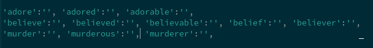

# Fantasy-Language-Translator
A pre-programmed translator that allows you to contstruct a fictional but rather functional language. 

Currently, it only translates up to two words a key. Outside of that, this file is limited down to the core of the English language, so you will have to add nouns, verbs and adverbs as you go. I recommend formatting your sequence like this; 

 

